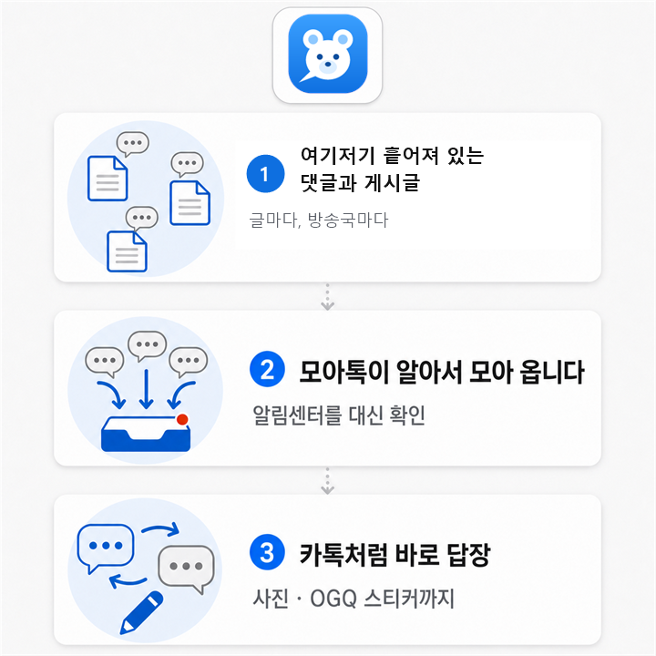
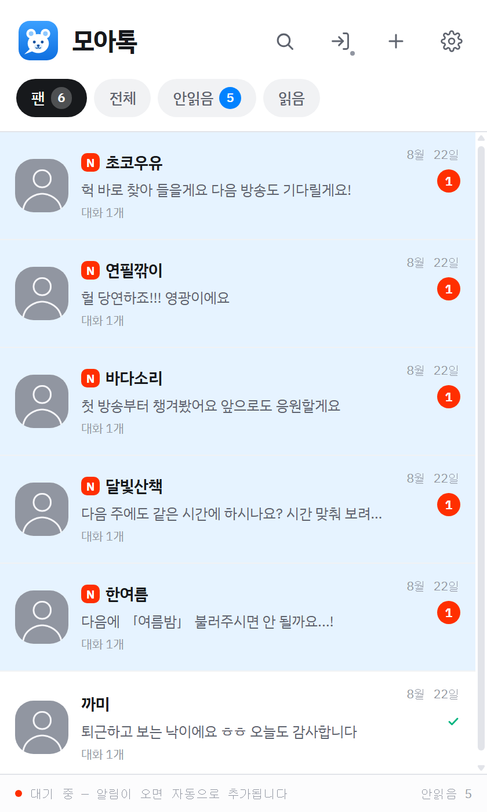
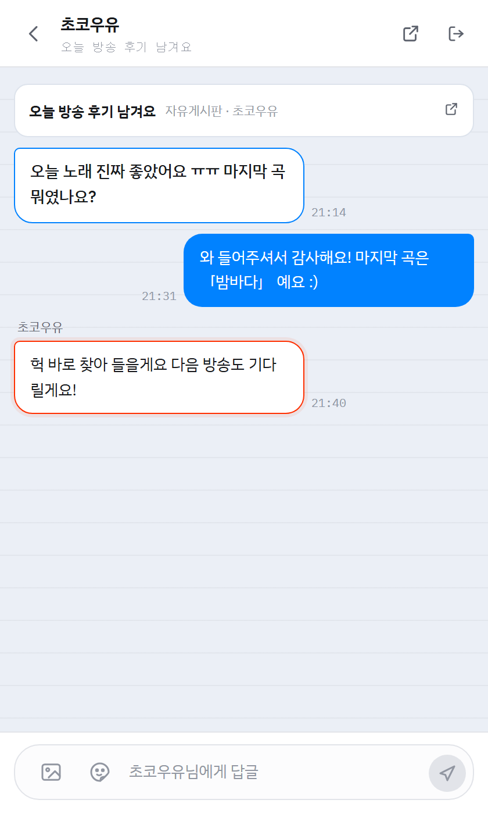

# 모아톡

**숲(SOOP) 게시글에 달린 댓글을 한곳에 모아, 카카오톡처럼 바로 답하는 프로그램**

윈도우용 · 무료

[**최신판 받기 →**](../../releases/latest)

 

 

## 이런 분께

글마다, 방송국마다 흩어진 댓글을 하나씩 찾아 들어가며 답하고 계셨다면.
어제 누가 뭐라고 남겼는지, 내가 답을 했는지 안 했는지 헷갈리셨다면.

 

## 화면

<table>
<tr>
<td width="50%" valign="top">

**사람별로 모입니다**

누가 답장을 기다리고 있는지 한눈에 보입니다.
답장이 필요한 사람이 위로 올라옵니다.

</td>
<td width="50%" valign="top">

**대화처럼 보입니다**

원래 글과 주고받은 답글이 한 줄기로 이어집니다.
아래 칸에 쓰고 보내면 그대로 숲에 올라갑니다.

</td>
</tr>
</table>

> 위 화면의 닉네임과 게시글은 모두 예시로 만든 것입니다.

 

## 받기 · 설치

1. [Releases](../../releases/latest) 에서 **`moatalk-setup-x.x.x.exe`** 를 받습니다.
   (`latest.yml`, `.blockmap`, `Source code` 는 프로그램이 쓰는 파일이라 받지 않으셔도 됩니다.)

2. 실행하면 **"Windows의 PC 보호"** 파란 창이 뜹니다.
   **추가 정보 → 실행** 을 눌러 주세요.

   > 프로그램에 문제가 있어서가 아니라, 코드 서명 인증서를 구입하지 않아서 뜨는 안내입니다.
   > 개인이 만든 프로그램에서 흔히 나옵니다.

3. 관리자 권한은 필요하지 않습니다. 내 계정 폴더에만 설치됩니다.

 

## 쓰는 법

### 1. 로그인

앱을 켜고 **[SOOP 로그인]** 을 누르면 앱 안에서 숲 로그인 창이 열립니다.
평소 쓰시는 숲 계정으로 로그인하세요.

> 로그인은 앱 안에 띄운 **진짜 숲 페이지**에서 이루어집니다.
> 아이디와 비밀번호는 이 프로그램이 보지도, 저장하지도 않습니다.

### 2. 무엇을 모을지 고르기

처음 켜면 한 번 물어봅니다.

| 고르는 것 | 이런 분께 |
|---|---|
| **내 게시글 댓글도 모으기** | 시청자로 활동하시는 분 |
| **남의 방송국에 쓴 것만** | 스트리머 — 내 방송국은 어차피 한 곳만 보면 되니까요 |

설정(⚙️)에서 언제든 바꿀 수 있습니다.

### 3. 기다리기

로그인하면 알림센터를 읽어서, 내 글에 댓글을 남긴 분들을 자동으로 찾아 옵니다.
**처음에는 몇 분 걸립니다.** 과거 기록까지 훑기 때문입니다.

그 뒤로는 새 댓글이 오면 알아서 들어옵니다. 방송국을 손으로 추가하지 않아도 됩니다.

### 4. 답하기

사람을 누르면 대화 목록, 대화를 누르면 주고받은 내용이 나옵니다.
아래 칸에 쓰고 보내면 숲에 답글로 올라갑니다.

- 🖼️ **사진** — 왼쪽 그림 단추
- 😀 **OGQ 스티커** — 그 옆 얼굴 단추. 글자와 같이 보낼 수 있습니다
- 글자 수가 실시간으로 표시됩니다

 

## 알아두실 점

**창을 닫아도 꺼지지 않습니다.** 카카오톡처럼 트레이(시계 옆)로 들어가서 계속 확인합니다.
완전히 끄시려면 트레이 아이콘 → 마우스 오른쪽 → **종료**.

**답장 필요** 표시는 그 대화의 **마지막 말이 내 것이 아닐 때** 뜹니다.
내가 답했으면 사라지고, 상대가 또 말하면 다시 생깁니다.

**대화 나가기** 는 목록에서만 숨깁니다. 숲에서 지워지지 않고, 그 사람이 새로 말을 걸면 다시 올라옵니다.

**가리기 모드** 를 켜면 닉네임·아이디·방송국 이름이 가짜로 바뀝니다. 방송에 화면을 띄우실 때 쓰세요.

 

## 자료는 어디에 있나요

**전부 본인 PC 안에만 있습니다** (`%APPDATA%\모아톡`).
만든 사람의 서버로는 아무것도 보내지 않습니다. 보낼 서버도 없습니다.

프로그램이 인터넷으로 연결하는 곳은 **숲(SOOP)** 과, 새 버전을 확인하는 **GitHub** 뿐입니다.

자세한 내용은 프로그램 안 **설정 → 약관·개인정보** 에서 보실 수 있습니다.

 

## 업데이트

새 버전이 나오면 프로그램이 알려 드리고 알아서 받습니다.
**직접 다시 받으실 필요는 없습니다.** 받아 둔 파일이 낡았어도, 설치 후 켜면 최신판으로 올라갑니다.

 

## 문의

프로그램에 문제가 생기면 화면에 **오류 번호**(`MT-101` 같은)가 표시됩니다.
그 번호와 함께 [Issues](../../issues) 에 남겨 주세요. 번호만 있어도 어디서 막혔는지 알 수 있습니다.

 

---

### 숲과의 관계

**이 프로그램은 비공식 프로그램입니다.**
주식회사 숲(SOOP)과 아무 관계가 없으며, 숲의 승인이나 후원을 받지 않았습니다.
숲의 상표는 각 권리자의 것입니다.

프로그램은 있는 그대로 제공되며, 사용 중 생긴 손해에 대해 만든 사람은 책임지지 않습니다.
중요한 답글은 보내신 뒤 숲에서 한 번 더 확인해 주세요.

이 프로그램을 더 이상 제공하지 않게 되면 **최소 3개월 전에 미리 알려 드립니다.**

이 저장소는 배포용입니다. 설치 파일과 프로그램이 참고하는 설정 파일만 들어 있습니다.
